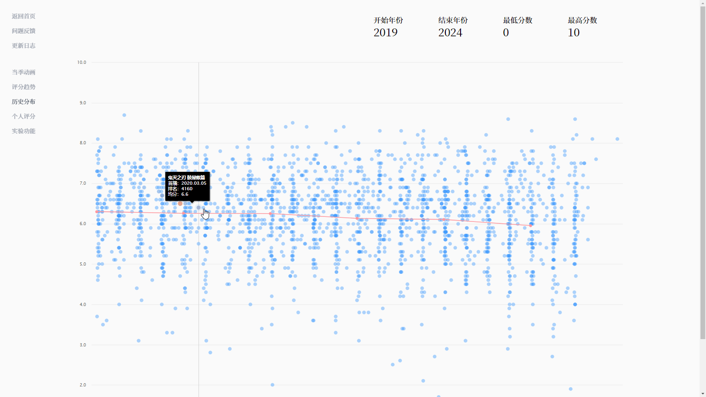
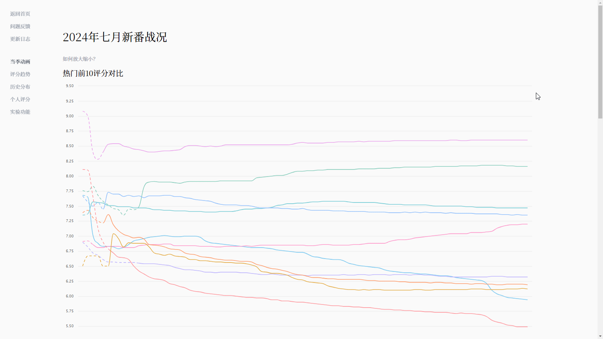
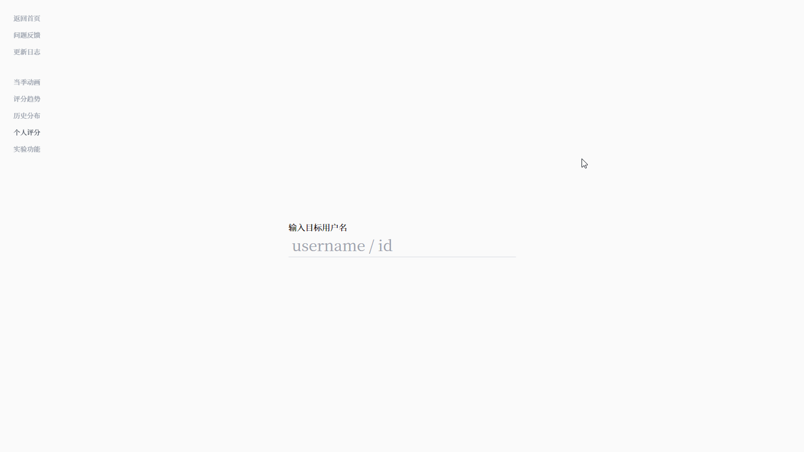

# Netabare

**Netabare** is vue3 based frontend for [https://netaba.re](https://netaba.re), an analytics web app that tracks trending animes in China. It pulls data from [Bangumi](https://bgm.tv), the most popular anime review site in China, and lets you see daily changes in rankings and popularity.

> [!TIP]
> Fun fact: "Netabare" (ネタバレ) is a Japanese term that means "spoiler", so spoiler alert!

## Charts, Charts, and More Charts

Build with highcharts, Netabare has ton of beautiful crafted, fully animated charts to help you understand the data better.

## License

MIT
