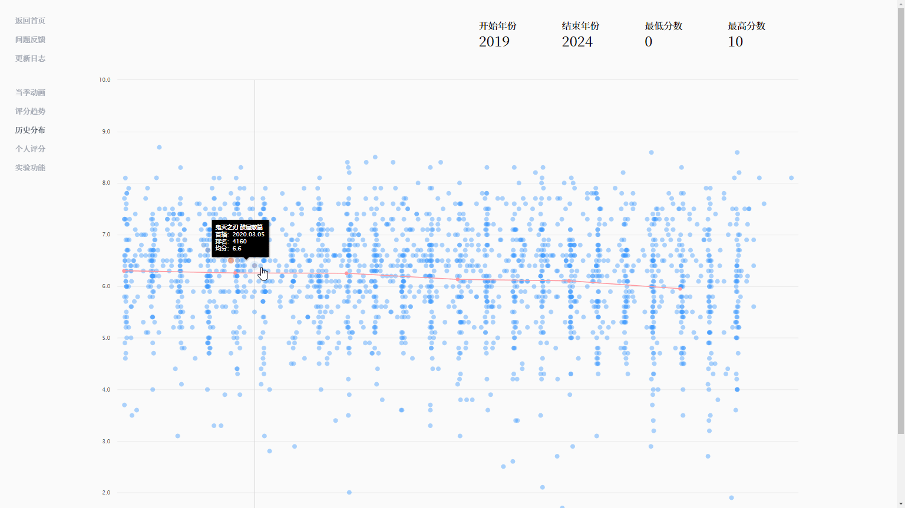
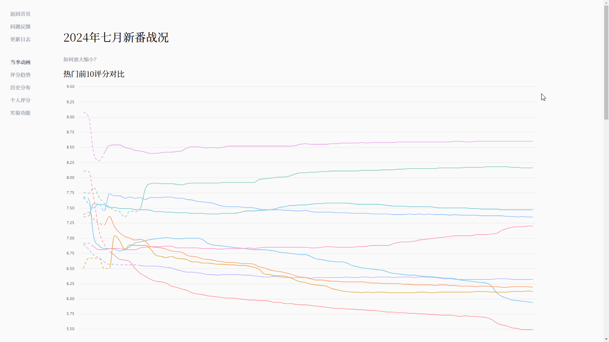
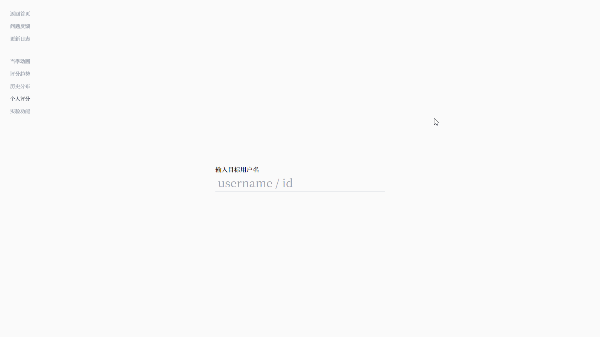

# Netabare

**Netabare** is vue3 based frontend for [https://netaba.re](https://netaba.re), an analytics web app that tracks trending animes in China. It pulls data from [Bangumi](https://bgm.tv), the most popular anime review site in China, and lets you see daily changes in rankings and popularity.

> [!TIP]
> Fun fact: "Netabare" (ネタバレ) is a Japanese term that means "spoiler", so spoiler alert!


## Charts, Charts, and More Charts

Build with highcharts, Netabare has ton of beautiful crafted, fully animated charts to help you understand the data better.





## Dev Helpers

### SVG text outlines

Use the local outline helper when loading-screen or logo text needs to render as SVG geometry instead of live font text.

Install the Python helper dependency locally once:

```sh
python -m pip install fonttools
```

Generate Vue-ready glyph data:

```sh
npm run outline-text -- "载入秋色" \
  --font "$LOCALAPPDATA/Microsoft/Windows/Fonts/SourceHanSerif.ttc" \
  --face-name "Source Han Serif SC" \
  --weight Bold \
  --font-size 120 \
  --format vue
```

For variable fonts, pass a numeric `wght` value instead:

```sh
npm run outline-text -- "4" \
  --font "./path/to/VariableFont.ttf" \
  --weight 700 \
  --format svg
```

Pass `--normalize-bounds` with `--format svg` when generated glyphs need their visible outlines centered inside the SVG viewBox, such as mask artwork that stacks across states.

Do not commit installed Python packages or generated cache folders.

## License

MIT
